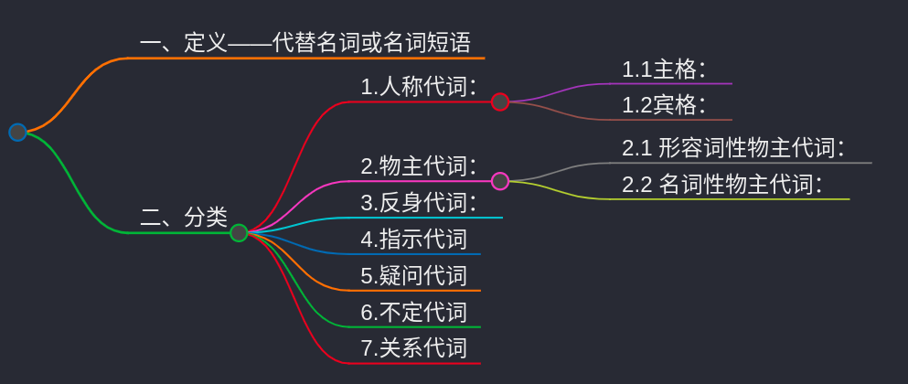

# 一、定义——代替名词或名词短语

在英语中，代词是用来`代替名词或名词短语`的词，它在句子中能`避免重复`，使表达更加`简洁、流畅`。

常见的代词可分为以下几类:

# 二、分类
## 1.人称代词：
表示 `“我”“你”`“他 / 她 / 它”“我们”“你们”“他们 / 她们 / 它们” 等。

### 1.1主格：

作句子的主语。

如` I（我）、you（你；你们）`、`he（他）、she（她）`、`it（它）、we（我们）`、`they（他们；她们；它们）`。例如：`She` is a teacher.（她是一名教师。）

### 1.2宾格：

作`动词或介词`的宾语。

如 `me（我）、you（你；你们）、him（他）、her（她）、it（它）、us（我们）、them（他们；她们；它们）`。例如：Give me a book.（给我一本书。）

---
## 2.物主代词：

### 2.1 形容词性物主代词：
具有`形容词`的性质，不能单独使用，`必须后面接名词`。

如 my（我的）、your（你的；你们的）、his（他的）、her（她的）、its（它的）、our（我们的）、their（他们的；她们的；它们的）。例如：This is `my book`.（这是我的书。）

### 2.2 名词性物主代词：
具有`名词`的性质，相当于 `“形容词性物主代词 + 名词”`，可以单独使用。

如 `mine`（我的）、`yours`（你的；你们的）、`his`（他的）、`hers`（她的）、`its`（它的）、`ours`（我们的）、`theirs`（他们的；她们的；它们的）。例如：This book is mine.（这本书是我的。）。

---
## 3.反身代词：
表示 `“某人自己”`。

如 `myself`（我自己）、`yourself`（你自己）、`himself`（他自己）、`herself`（她自己）、`itself`（它自己）、`ourselves`（我们自己）、`yourselves`（你们自己）、`themselves`（他们自己；她们自己；它们自己）。反身代词常作宾语或同位语，例如：He hurt `himself`.（他伤了自己。）；I `myself` did it.（我自己做的这件事。）

---
## 4.指示代词
用来`指示或标识人或事物`。

如 `this`（这个）、`that`（那个）、`these`（这些）、`those`（那些）、`such`（这样的；如此的）、`same`（相同的）。例如：This is a pen.（这是一支钢笔。）；Those are my friends.（那些是我的朋友。）

---

## 5.疑问代词
用来构成`特殊疑问句`。

如 `who`（谁，主格）、`whom`（谁，宾格）、`whose`（谁的）、`what`（什么）、`which`（哪一个；哪些）。例如：`Who` is your teacher?（谁是你的老师？）；`What `do you want?（你想要什么？）

---

## 6.不定代词

`不明确指代某个特定的人或事物`。

如 `some`（一些，用于肯定句）、`any`（一些，用于否定句和疑问句）、`no`（没有）、`none`（没有一个；毫无）、`all`（全部；都）、`both`（两者都）、`either`（`两者中的任何一个`）、`neither`（两者都不）、`each`（每个，强调个体）、`every`（每个，强调整体）、`many`（许多，修饰可数名词）、`much`（许多，修饰不可数名词）、`few`（很少，几乎没有，修饰可数名词，表否定）、`a few`（一些，修饰可数名词，表肯定）、`little`（很少，几乎没有，修饰不可数名词，表否定）、`a little`（一点，修饰不可数名词，表肯定）等。例如：Some students like English.（一些学生喜欢英语。）；Neither of them is right.（他们两个都不对。）

---
## 7.关系代词

用于`引导定语从句`，`连接先行词和定语从句`。

如 `who`（指人，作主语或宾语）、`whom`（指人，作宾语）、`whose`（指人或物，作定语）、`which`（指物，作主语或宾语）、`that`（指人或物，作主语或宾语）。

例如：The man who is standing there is my father.（站在那儿的那个人是我的父亲。）；This is the book that I want.（这就是我想要的那本书。 ）

