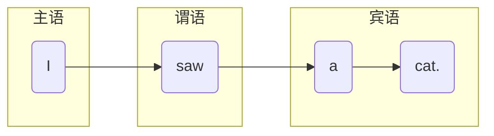
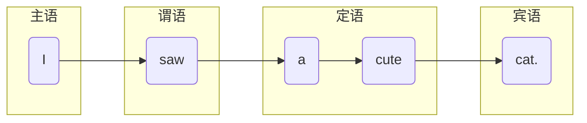
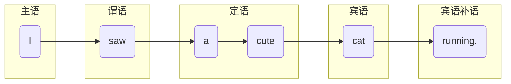
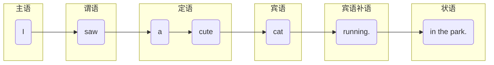
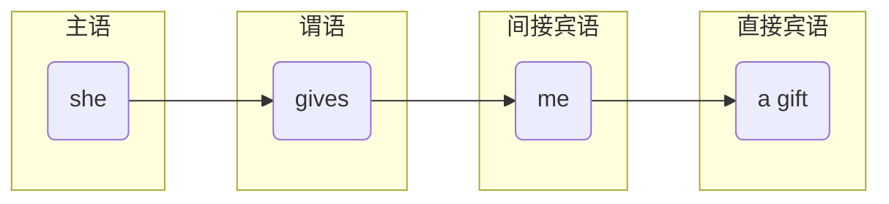
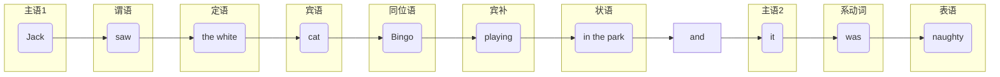
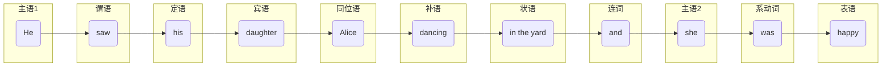
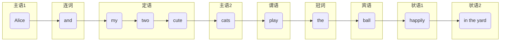

# 一、秒懂句子成分

## 1.主-谓-宾
我看见了一只猫

---
## 2.主-谓-定-宾
定语：形容词，一般用于修饰名词

我看见了一只可爱的猫

---
## 3.主-谓-定-宾-宾补
### 宾补：
是宾语的补语，一般用于对宾语的进一步介绍

我看见了一只可爱的猫在跑

---
## 3.主-谓-定-宾-宾补-状语
状语：状语（Adverbial）是用于`修饰动词、形容词、副词或整个句子等的句子成分`，它可以用来`表示时间、地点、方式、程度、原因、条件、让步`等多种语义。

我看见了一只可爱的猫在跑

## 4.主语-谓语-定语-间接宾语-直接宾语
间接宾语：动作的`间接对象`，一般是名词

直接宾语：动作的`直接对象`，一般是名词

她给我一个礼物

---
## 5.主语-谓语-定语-宾语-同位语-宾补-状语-主语-系动词-表语

### 1.同位语
同位语：同位语（Appositive）是一种对`句子中某一名词或代词进行进一步解释、说明或限定`的语法成分。它和被修饰的词`在语法地位上是等同`的，也就是在句子中具有相同的语法功能。这里就是使用名词做同位语，即Bingo是猫的名字，和猫同等地位！

### 2.系动词
系动词（Linking Verb），也称为连系动词，是英语中一种特殊的动词，它本身有词义，但不能单独作谓语，必须和表语一起构成谓语，用来说明主语的状态、性质、特征、身份或情况等。

### 3.表语
表语（Complement）是指句子中用于`补充或说明`主语、谓语、宾语等成分的`词语或短语`。它可以是`名词、形容词、副词、介词短语、从句`等。

杰克在公园里看到那只白色小猫咪（Bingo）在玩，它很顽皮。

## 6.主-谓-定-宾-同位语-补语-状语-连词-主语-系动词-表语

### 1.补语：
补语（Complement）是句子中一种重要的成分，用于`补充说明句子中主语或宾语的相关信息`，使句子的意思更加完整。补语可分为`主语补足语`和`宾语补足语`.这里的dancing就是宾补！因为修饰的是宾语！

## 7.

