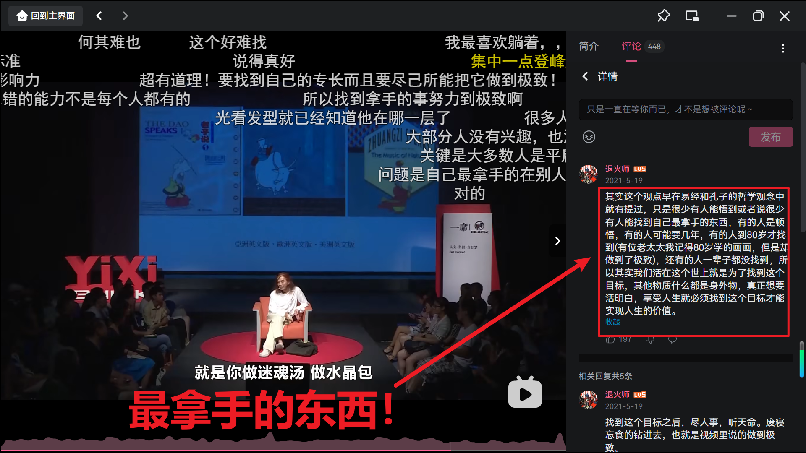

# 心得
## .p法
就是最普通的死记硬背，.p后面跟着中文译音，这样可以很方便的翻出来，用来中文音猜英文意思

## 蔡志忠法(x-y轴记忆法)
### 100万根钥匙
人的大脑记忆东西分为两个步骤，一个是记，一个是忆。记就是自己将东西放进抽屉里面，忆就是你用钥匙将东西再取出来。我们往往放进去容易，但是取出来难。但是戏剧性的是
往往是取这个动作才有意义，并且记的意义就是忆。那如何忆？人脑对应的抽屉有100万根钥匙，我们怎么找到对应的钥匙？
——
**答案是大的东西——大的东西一眼就能看见**，就像钥匙堆里面，一串钥匙最显眼，所以人脑也是这样的，我们可以将一连串的东西连起来记忆，这就相当于思维导图

### 例如：
通过联想记忆
**ABCDEFG很简单**
**one很简单**
把他们组合起来就记住了很多难的单词！
one 
A-one 头等的，第一流的
bone 骨头
cone 圆锥体
done 完成
gone 消失
tone 音色
zone 取余
phone 电话
stone 石头
T-bone 丁骨牛排

这样10个单词就被one扣住了！

## 拆分法
erroneous 错误的
err+one+ous
这样记忆再怎么都不会忘记！

